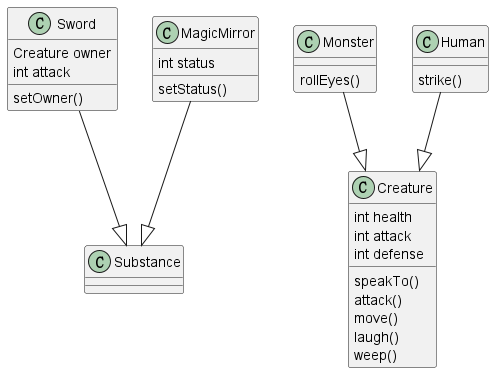

选取视频 [葫芦兄弟](https://www.bilibili.com/video/BV1Fk4y1V7Lf?p=6&vd_source=d66d6ccdd7011d0fc85c17c90f8b980d)
中 7:00 ~ 8:04 的桥段

类型设计（建模）如下：




桥段场景如下：


得到运行结果：

```
thirdChild strike the magicMirror.
MagicMirror is broken.
scorpion is weeping.
scorpion tell thirdChild '呜呜呜，我的宝贝……'
snake throw magicMirror to thirdChild
thirdChild parries it.
thirdChild tell snake '你们这些害人精，还不快投降!'
snake roll his/her eyes
snake is laughing.
snake tell thirdChild '你凭着一副钢筋铁骨竟就如此夸口,你可知道老娘的厉害。'
thirdChild tell snake '哈哈哈哈，你有什么本事,就拿出来吧!'
snake tell thirdChild '好!'
snake acquires a sword!
thirdChild is laughing.
snake tell thirdChild '哦？你难道不怕我这宝剑吗？'
thirdChild tell snake '你干脆把所有的兵器都拿出来吧，我还可以陪你玩玩。'
```