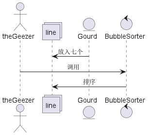
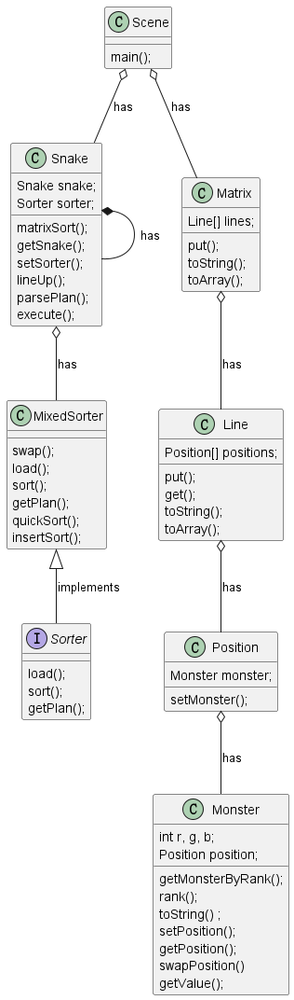

# 任务一

example的类图：

Scene中main方法执行过程中的对象时序图：

example的设计理念：通过面向对象的方式，将葫芦娃、场景、爷爷、排序算法等都抽象成对象，通过对象之间的交互来实现场景的描述。

好处：使代码更加清晰，更容易理解和维护。

可改进之处：对于排序算法的实现，可以使用泛型，使得排序算法不依赖于具体的数据类型，而是可以适用于更多的数据类型。

# 任务二

类图：

256种颜色从[该图片](../c256.png)中提取，每个小妖怪有一种颜色，初始化时小怪打乱顺序，排序时按照颜色值排序，
最终排序结果为从左到右，从上到下，颜色在图片上排列的顺序。排序过程使用了两种排序方式，快速排序和插入排序，
当小妖怪数量小于等于16时使用插入排序， 否则使用快速排序。

可视化结果展示链接：[视频](https://clipchamp.com/watch/SFReOfbL2LR "Clipchamp")

# 任务三

排序规则和排序结果与任务二相同，类图：

新增了Matrix类，拥有成员Line[]，同时在Snake中增加了matrixSort方法。

可视化结果展示链接：[视频](https://clipchamp.com/watch/Iqqniy9uWG9 "Clipchamp")